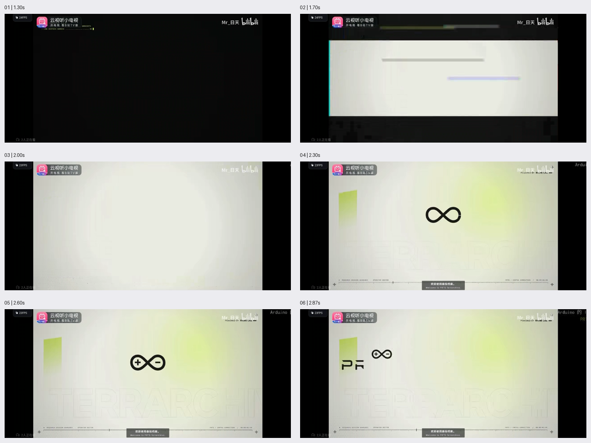

# 动效

开屏动效与 Logo 从中央向左上移动的参考记录。

## 参考内容

- [参考视频](原始参考.mp4)：约 2.867 秒，1280 × 576，30 fps。
- [完整动效记录](动效记录.txt)：阶段时间、运动方式、逐帧坐标与参考边界。
- [关键帧总览](关键帧总览.png)。
- [完整动效素材包](动效素材.zip)：包含全部关键帧和分析记录。解压后，`关键帧/` 为每 0.25 秒取样，`逐帧分析/` 为每 0.1 秒取样，结尾加密至约每帧。

## 开屏顺序

黑底停留 → 左上终端文字逐行出现 → 浅色矩形向上下展开并伴随故障条带 → 黄绿色光晕与背景细节显现 → 中央 Logo 轮廓形成并补出“+ / −” → 短暂停留。

## Logo 向左上移动

约 2.70—2.73 秒开始，向左、向上移动，同时等比例缩小；左侧字标开始出现。可见部分起步较慢，随后加速，没有明显旋转或回弹。

参考片段在移动途中结束，最终停靠位置、最终大小、完整移动时长与精确缓动曲线尚未展示。这里保存的是参考素材和观察记录。

记录日期：2026-10-07。
